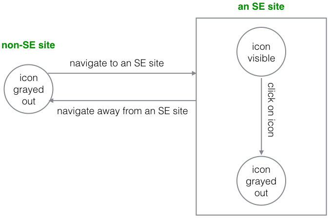

# NoSidebar 

This Chrome extension hides the "Hot Network Questions" sidebar on StackExchange websites. Let the friendly tangled cat help you keep your mind free from distractions of Buzzfeed-worthy question titles! If you want to take a peek after all, click on the cat to reveal the sidebar.

## Functionality

The "Hot Network Questions" sidebar stays hidden while the extension icon is visible.

## Implementation Notes

#### Actions
A Chrome extension's icon in the address bar is an *action* - somewhat confusingly named so because that's how the user interacts with the extension. Depending on what the extension wants to do, it can either be a [Browser Action](https://developer.chrome.com/extensions/browserAction) or a [Page Action](https://developer.chrome.com/extensions/pageAction). A Browser Action is always visible and can be interacted with anytime on any website. A Page Action is disabled (grayed out) by default, and is meant to be enabled by the developer based on context.

Since we want to interact with the extension only on StackExchange sites, and only if it has hidden the "Hot Network Questions" sidebar, we're using the Page Action.

#### Scripts
A [Content Script](https://developer.chrome.com/extensions/content_scripts) has access to the DOM of the current tab, but doesn't have access to most of the `chrome.*` APIs, including actions. The way content scripts can request those actions nonetheless is by sending and receiving messages to [Event Pages](https://developer.chrome.com/extensions/event_pages) running in the background.

#### Putting it together
1. The content script is triggered on sites specified in the manifest.
2. Once it's triggered, the content script sends a message to the event script to enable the Page Action, and hides the sidebar on response.
3. The event script listens to clicks on the Page Action. On click, it sends a message to the content script to show the sidebar, and disables the Page Action.

There are many more considerations on best practices (you can start with [messaging](https://developer.chrome.com/extensions/messaging)) for when you're building a more complex extension.

## Credits
- Tangled cat icon by [Iconka](http://iconka.com/).
